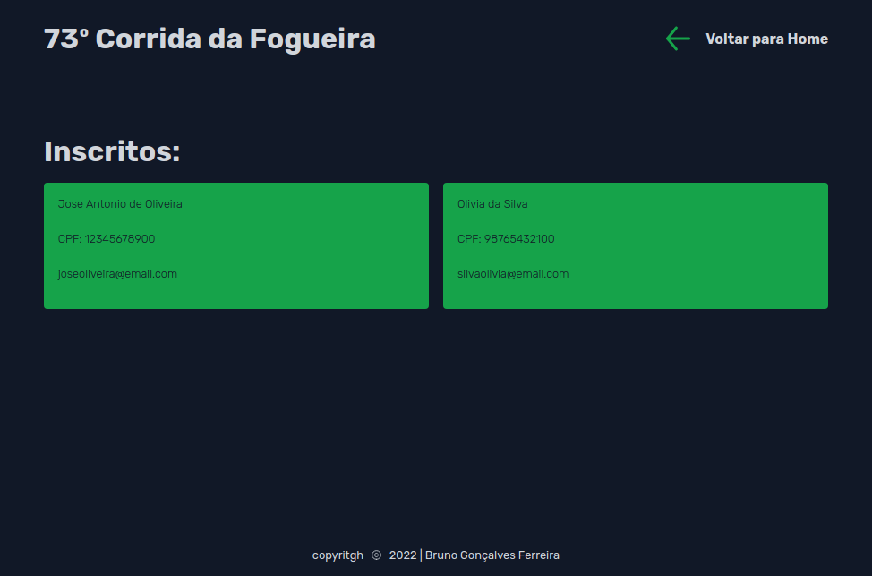
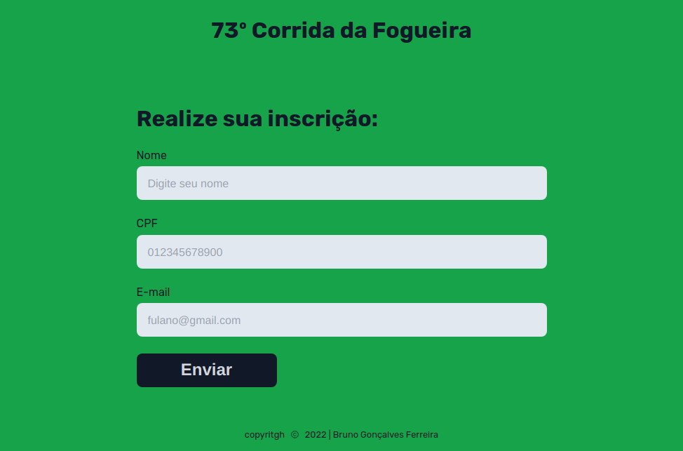

<h1 align="center">
    Cadastro de Pessoas
</h1>

<p align="center">
 <a href="#-sobre-o-projeto">Sobre</a> •
 <a href="#-funcionalidades">Funcionalidades</a> •
 <a href="#-layout">Layout</a> • 
 <a href="#-como-executar-o-projeto">Como executar</a> • 
 <a href="#-tecnologias">Tecnologias</a> • 
 <a href="#-contribuidores">Contribuidores</a> • 
 <a href="#-autor">Autor</a> • 
 <a href="#user-content--licença">Licença</a>
</p>

## 💻 Sobre o projeto

A ideia do projeto seria um sistema de cadastro de pessoas para participação de um evento de corrida de rua.

---

## ⚙️ Funcionalidades

- [x] Pessoas podem se cadastrar na plataforma web enviando:

  - [x] Seu nome completo.
  - [x] Seu documento de identificação.
  - [x] Seu email para que os envolvidos possam entrar em contato.

---

## 🎨 Layout

O layout da aplicação está disponível no Figma:

<a href="https://www.figma.com/file/Jl2xZJ7hvoIAgsRGGpQlXr/Cadastro-de-Participantes?node-id=0%3A1&t=XbzQJylhXZvmNWHL-0">
  
</a>

### Preview

<p align="center" style="display: flex; align-items: flex-start; justify-content: center;">
  

</p>
<p align="center" style="display: flex; align-items: flex-start; justify-content: center;">
  

</p>
<p align="center" style="display: flex; align-items: flex-start; justify-content: center;">
  

</p>

---

## 🚀 Como executar o projeto

Este projeto é divido em três partes:

1. Backend (pasta server)
2. Frontend (pasta web)

💡Frontend precisa que o Backend esteja sendo executado para funcionar.

### Pré-requisitos

Antes de começar, você vai precisar ter instalado em sua máquina as seguintes ferramentas:
[Git](https://git-scm.com), [Node.js](https://nodejs.org/en/).
Além disto é bom ter um editor para trabalhar com o código como [VSCode](https://code.visualstudio.com/)

#### 🎲 Rodando o Backend (servidor)

```bash

# Clone este repositório
$ git clone git@github.com:tgmarinho/README-ecoleta.git

# Acesse a pasta do projeto no terminal/cmd
$ cd README-ecoleta

# Vá para a pasta server
$ cd server

# Instale as dependências
$ npm install

# Execute a aplicação em modo de desenvolvimento
$ npm run dev:server

# O servidor inciará na porta:3333 - acesse http://localhost:3333

```

<p align="center">
  <a href="https://github.com/tgmarinho/README-ecoleta/blob/master/Insomnia_API_Ecoletajson.json" target="_blank"></a>
</p>

#### 🧭 Rodando a aplicação web (Frontend)

```bash

# Clone este repositório
$ git clone git@github.com:tgmarinho/README-ecoleta.git

# Acesse a pasta do projeto no seu terminal/cmd
$ cd README-ecoleta

# Vá para a pasta da aplicação Front End
$ cd web

# Instale as dependências
$ npm install

# Execute a aplicação em modo de desenvolvimento
$ npm run start

# A aplicação será aberta na porta:3000 - acesse http://localhost:3000

```

---

## 🛠 Tecnologias

As seguintes ferramentas foram usadas na construção do projeto:

#### **Website** ([React](https://reactjs.org/) + [TypeScript](https://www.typescriptlang.org/))

- **[React Router Dom](https://github.com/ReactTraining/react-router/tree/master/packages/react-router-dom)**
- **[React Icons](https://react-icons.github.io/react-icons/)**
- **[Axios](https://github.com/axios/axios)**
- **[Leaflet](https://react-leaflet.js.org/en/)**
- **[React Leaflet](https://react-leaflet.js.org/)**
- **[React Dropzone](https://github.com/react-dropzone/react-dropzone)**

> Veja o arquivo [package.json](https://github.com/tgmarinho/README-ecoleta/blob/master/web/package.json)

#### [](https://github.com/tgmarinho/Ecoleta#server-nodejs--typescript)**Server** ([NodeJS](https://nodejs.org/en/) + [TypeScript](https://www.typescriptlang.org/))

- **[Express](https://expressjs.com/)**
- **[CORS](https://expressjs.com/en/resources/middleware/cors.html)**
- **[KnexJS](http://knexjs.org/)**
- **[SQLite](https://github.com/mapbox/node-sqlite3)**
- **[ts-node](https://github.com/TypeStrong/ts-node)**
- **[dotENV](https://github.com/motdotla/dotenv)**
- **[Multer](https://github.com/expressjs/multer)**
- **[Celebrate](https://github.com/arb/celebrate)**
- **[Joi](https://github.com/hapijs/joi)**

> Veja o arquivo [package.json](https://github.com/tgmarinho/README-ecoleta/blob/master/server/package.json)

#### [](https://github.com/tgmarinho/Ecoleta#mobile-react-native--typescript)**Mobile** ([React Native](http://www.reactnative.com/) + [TypeScript](https://www.typescriptlang.org/))

- **[Expo](https://expo.io/)**
- **[Expo Google Fonts](https://github.com/expo/google-fonts)**
- **[React Navigation](https://reactnavigation.org/)**
- **[React Native Maps](https://github.com/react-native-community/react-native-maps)**
- **[Expo Constants](https://docs.expo.io/versions/latest/sdk/constants/)**
- **[React Native SVG](https://github.com/react-native-community/react-native-svg)**
- **[Axios](https://github.com/axios/axios)**
- **[Expo Location](https://docs.expo.io/versions/latest/sdk/location/)**
- **[Expo Mail Composer](https://docs.expo.io/versions/latest/sdk/mail-composer/)**

> Veja o arquivo [package.json](https://github.com/tgmarinho/README-ecoleta/blob/master/mobile/package.json)

#### [](https://github.com/tgmarinho/Ecoleta#utilit%C3%A1rios)**Utilitários**

- Protótipo: **[Figma](https://www.figma.com/)** → **[Protótipo (Ecoleta)](https://www.figma.com/file/1SxgOMojOB2zYT0Mdk28lB/Ecoleta)**
- API: **[IBGE API](https://servicodados.ibge.gov.br/api/docs/localidades?versao=1)** → **[API de UFs](https://servicodados.ibge.gov.br/api/docs/localidades?versao=1#api-UFs-estadosGet)**, **[API de Municípios](https://servicodados.ibge.gov.br/api/docs/localidades?versao=1#api-Municipios-estadosUFMunicipiosGet)**
- Maps: **[Leaflet](https://react-leaflet.js.org/en/)**
- Editor: **[Visual Studio Code](https://code.visualstudio.com/)** → Extensions: **[SQLite](https://marketplace.visualstudio.com/items?itemName=alexcvzz.vscode-sqlite)**
- Markdown: **[StackEdit](https://stackedit.io/)**, **[Markdown Emoji](https://gist.github.com/rxaviers/7360908)**
- Commit Conventional: **[Commitlint](https://github.com/conventional-changelog/commitlint)**
- Teste de API: **[Insomnia](https://insomnia.rest/)**
- Ícones: **[Feather Icons](https://feathericons.com/)**, **[Font Awesome](https://fontawesome.com/)**
- Fontes: **[Ubuntu](https://fonts.google.com/specimen/Ubuntu)**, **[Roboto](https://fonts.google.com/specimen/Roboto)**

<!-- ## 👨‍💻 Contribuidores

💜 Um super thanks 👏 para essa galera que fez esse produto sair do campo da ideia e entrar nas lojas de aplicativos :)

<table>
  <tr>
    <td align="center"><a href="https://github.com/brunogoncalvesferreira"><br /><sub><b>Bruno Gonçalves</b></sub></a></td>

  </tr>

</table>

## 💪 Como contribuir para o projeto

1. Faça um **fork** do projeto.
2. Crie uma nova branch com as suas alterações: `git checkout -b my-feature`
3. Salve as alterações e crie uma mensagem de commit contando o que você fez: `git commit -m "feature: My new feature"`
4. Envie as suas alterações: `git push origin my-feature`
> Caso tenha alguma dúvida confira este [guia de como contribuir no GitHub](./CONTRIBUTING.md) -->

---

## 🦸 Autor

<a href="https://github.com/brunogoncalvesferreira"><br /><sub><b>Bruno Gonçalves</b></sub></a></a>
<br />

[](https://twitter.com/BrunoGoferreir) [](https://www.linkedin.com/in/bruno-goncalves-ferreira/)
[](mailto:brunogonferreira@gmail.com)

---

## 📝 Licença

Este projeto esta sobe a licença [MIT](./LICENSE).

Feito com ❤️ por Thiago Marinho 👋🏽 [Entre em contato!](https://www.linkedin.com/in/tgmarinho/)

---
# race-registration
